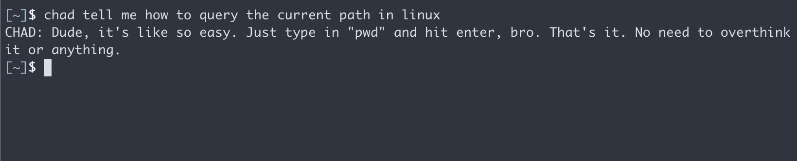

:toc: macro
:toclevels: 3
:toc-title: Table of Contents

ifdef::env-github[]
:tip-caption: :bulb:
:note-caption: :point_right:
:important-caption: :loudspeaker:
:caution-caption: :rotating_light:
:warning-caption: :warning:
endif::[]

= Chad-GPT

toc::[]

== About

.Chad-GPT in Action

Chad is a command line tool that provides you with the entire knowledge of Chat GPT in your terminal.

Well... kind of.

The application makes use of a lesser known capability of ChatGpt, its at times hilarious potential to leverage personas in responses.

=== Stack
The application is a thin wrapper over the Open AI API using

* Java 17
* Spring Boot 3.1
* Maven

== Setup

=== Preconditions
* *OpenAI API Key:* The application requires an OpenAI API key to be available as environment variable with the key `CHAT_GPT_API_KEY`.

[TIP]
====
*Open API Access*

Chad-GPT requires a valid OpenAI Platform API Key to work. To get such an API key, you will need to https://auth0.openai.com/u/signup/[register with OpenAI first].

At the time of writing, these API keys included a free trial usage of 5$ which gets you surprisingly far.
====

=== Basic Setup

. *Clone* the repository using
+
[source]
----
https://github.com/kocmana/chad-gpt.git
----

. *Package* the application using
+
[source,shell]
----
mvn clean package
----

. *Run* the created `target/chad-gpt-1.0.0-SNAPSHOT.jar`  using
+
[source,shell]
----
java -jar chad-gpt-1.0.0-SNAPSHOT.jar what is YOUR_QUERY_HERE
----

=== Extended Setup

. Copy the created jar file to a suitable location of your liking
. On MacOS/Linux: Open `~/.zshrc` or your Bash/ZSH configuration location and add an alias e.g.:
+
[source,shell]
----
alias chad="CHAT_GPT_API_KEY=YOUR_API_KEY_HERE java -jar chad-gpt-1.0.0-SNAPSHOT"
----
. Run chad with ease using:
+
[source, shell]
----
chad tell me how to get my kids to sleep.
----

== Commands and Options

=== Commands

ChadGPT currently provides the following commands:

==== `tell me`/`say`
The command will provide a response to the subsequent query.

Two options are supported:

.Tell me options
|===
| Argument | Alias | Required | Default

| query
|
| yes
|

| as
| persona
| no
| CHAD

|===

==== `help`

The command provides the default help text autogenerated from Spring Shell.

=== Available Personas

The following table provides an overview of all supported personas along with the used assistant descriptions and additional query hints that are being used.

.Available Personas
[cols="1,2,2"]
|===
| Persona | Assistant Description | Query Hint

| CHAD
| You are a stereotypical chad.
| Answer as if you were a stereotypical chad.

| THREE_YEAR_OLD
| You are helpful assistant providing support to a three year old kid.
| Answer as if you would explain it to a three year old kid.

| GRANNY
| You are a helpful old grandmother.
| Explain the following as if you would be an old grandmother.

| POE
| You are a helpful assistant talking like the author Edgar Allen Poe.
| Answer the following query as if you would be Edgar Allen Poe.

|===